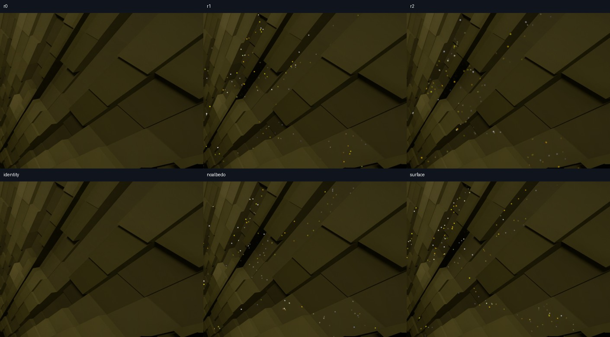

# Indirect-light prefilter: rejected

The 3×3 and 5×5 filters add persistent bright speckles to the torchlit stairway.
The no-filter controls do not. Disabling albedo normalization and using the
actual displaced parallax positions/normals do not remove the regression.
None of these diagnostic patches is selected or installed for normal play.



Columns are the no-op control, 3×3 filter, and 5×5 filter; the second row shows
the arithmetic identity control, filtering without albedo normalization, and
filtering with displaced surface geometry. This is a crop of the final settled
PNG in each run, not a frame selected for its worst artifact. The controls
retain the original transient cave defect; “no new speckles” does not mean
artifact-free gameplay.

## What was tested

Apply `prefilter-r1.patch` after the thirteen main MCVR patches, optional
cave-counts patches 0001–0005, and the pinned SHaRC allocation correction.
Its base is the installed runtime-update shader archive from jar
`e54e3c58c21c1539f777c6cbb6582bd342549a8c16ba44f98d9760973da7f0a0`.

The ray-generation shader records the complete continuation sample for rough,
nonmetallic, opaque first surfaces, independently of the randomly chosen BSDF
lobe. Direct light, emission, primary metals, smooth reflections and transparent
surfaces are excluded. A compute pass after final composition and before DLSS
RR replaces only this continuation, preserving the accumulated colored fog and
water attenuation. No rays, bounce limits or cache settings change.

The filter uses neighboring positions, geometric/shading normals and roughness.
It removes and reapplies the albedo guide to retain texture contrast. It does
not clamp radiance or use another temporal history. This is a small spatial
filter, not an implementation of full SVGF. Spatial reuse is biased; the
synthetic tests below do not establish whole-renderer energy accuracy.

Apply at most one additional patch after `prefilter-r1.patch`:

| Patch | Difference from r1 |
| --- | --- |
| `r0-after-r1.patch` | Radius zero; instrumentation retained, compute writes disabled |
| `r2-after-r1.patch` | 5×5 footprint |
| `identity-after-r1.patch` | Compute writes the original HDR value; compiler may eliminate identity arithmetic |
| `noalbedo-after-r1.patch` | Removes albedo division/remodulation only |
| `surface-after-r1.patch` | Supplies displaced primary positions and geometric normals in another image; tightens the plane threshold from 0.04 to 0.004 blocks |

The surface probe uses 32-bit positions rather than quantizing them into the
half-float lighting image. It still fails visibly. These probes rule out the
two isolated explanations as sufficient fixes; the source of the integrated
regression has not been conclusively established. In particular, the identity
control cannot prove every intermediate arithmetic operation executes, because
the compiler can simplify it.

## Validation and its limits

All three radius variants and the displaced-surface variant compile 174/174
actual-stage shader jobs. The identity and no-albedo probes change only the
compute shader and each compiles. The material-room r1 run and private cave
identity run confirm Khronos instance/device layers and synchronization
validation, with no reported validation errors.

The GPU fixture executes the shared filter helper on the RTX 5090. Twelve cases
per radius check constant illumination, albedo contrast, binomial cancellation
of checkerboard noise, surface/normal/roughness boundaries, invalid samples,
active image bounds, and colored fog/water composition. All 36 checks pass.
It does not exercise the game's image-loader bindings, real path-sample
distribution, or DLSS RR. The integrated cave result overrides the synthetic
success.

To reproduce the helper checks after applying r1, with `glslc`, a C++ compiler,
NumPy, Vulkan development libraries, the initialized Vulkan-Headers submodule,
and the Khronos validation layer available:

```sh
python3 tools/check-indirect-prefilter.py \
  --mcvr /path/to/MCVR \
  --source /path/to/MCVR/src/shader/world/ray_tracing/internal/advanced \
  --output /new/path/to/results \
  --layer-path /path/to/explicit_layer.d
```

Omit `--layer-path` if the layer is installed in the loader's normal search
path. The runner refuses to silently use a different GPU. For the game shader
compiler check, use `tools/check-advanced-shaders.py` with the selected pack
settings and record its manifest.

## Cave evidence

Six alternating rapid turns were captured per variant, with fixed exposure 2,
144 FPS caps, 60 Hz recording, 1334×750 rays and 2560×1440 output. Other settings:
48 light candidates, history cap 8, direct/indirect strengths 32/8, four bounces,
SHaRC update factor 5, SPBR, Voxy v17 and DLSS 310.9.1 preset F. All work used
the private world snapshot; the normal jar, settings and saved cave region
remained unchanged.

The failed filters' flicker exceeds the frame-difference threshold used to
detect the end of camera motion. That delays the detected end and contaminates
some “settled” windows with the next turn. Their raw `convergence.json` scores
are therefore invalid and are not reported as convergence measurements.
The final stationary PNGs independently show the regression.

The prefilter pass averages about 0.025 ms for r1 and 0.047 ms for r2 in the
last 1,000 settled GPU timing records. These are capped diagnostic pass costs,
not uncapped game throughput or physical display FPS. The identity run has
validation overhead and is not a performance comparison. The selected build
still has no verified strict 144 FPS floor or artifact-free fast-turn result.

The material-room r1 comparison changed mean gray levels by less than 0.27/255
in three fixed-exposure views. Those quiet views missed the cave failure.
Exact hashes, costs, protocol and scene-specific bright-pixel counts are in
[the measurements](../../measurements/indirect-prefilter-2026-09-27.json).
